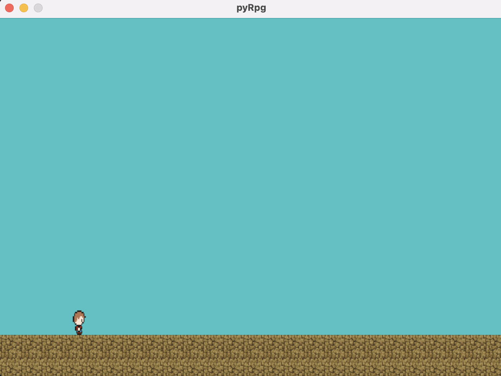

# pyPlayerMoveMotion

pyPlayerMoveMotionはPythonで作成されたシンプルなプレイヤー操作スクリプトです。シンプルなゲームプレイが楽しめます。

## インストール

1. Pythonをインストールします。
2. pygameライブラリをインストールします。
    ```
    pip install pygame
    ```

## 実行方法

1. `main.py`を実行します。

## 操作方法

- **移動**: AキーとDキーを使用して左右に移動します。
- **ジャンプ**: スペースキーを使用してジャンプします。
- **ゲームの終了**: Qキーを使用してゲームを終了します。



## ライセンス

このプロジェクトはMITライセンスのもとで公開されています。詳細については、[LICENSE](LICENSE)ファイルをご確認ください。

## 貢献

バグの報告や改善提案など、どんな貢献も歓迎します。プルリクエストやイシューをお気軽に作成してください。

## 作者

- [ReoF777](https://github.com/ReoF777)